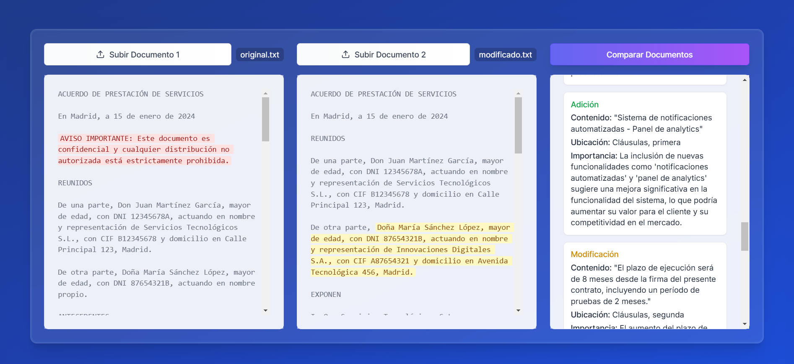

# Paralelo

Paralelo es una herramienta de comparación de documentos (en paralelo) que permite a profesionales y organizaciones analizar, rastrear y comprender cambios entre diferentes versiones de documentos de manera rápida y precisa.



## 🚀 Características

- **Comparación Inteligente**: Detección automática de adiciones, eliminaciones y modificaciones
- **Resaltado Visual**: Visualización clara de cambios con código de colores
- **Análisis de Impacto**: Análisis impulsado por IA sobre la importancia de los cambios
- **Múltiples Formatos**: Compatibilidad con archivos PDF y TXT
- **Interfaz Intuitiva**: Diseño moderno y amigable con soporte para arrastrar y soltar
- **Resúmenes Ejecutivos**: Generación automática de informes de cambios
- **Procesamiento en Tiempo Real**: Resultados de comparación instantáneos

## 🛠️ Tecnologías Utilizadas

- **Frontend**: React, TypeScript, Tailwind CSS
- **Componentes UI**: shadcn/ui
- **Gestión de Estado**: React Hooks
- **Integración API**: OpenAI GPT-4
- **Procesamiento PDF**: pdf.js
- **Manejo de Archivos**: Browser File API
- **Estilos**: Tailwind CSS con animaciones personalizadas

## 📋 Requisitos Previos

- Node.js 18.0 o superior
- Clave API de OpenAI para funciones de análisis avanzado
- Navegador web moderno (Chrome, Firefox, Safari, Edge)

## ⚙️ Instalación

1. Clonar el repositorio:
```bash
git clone https://github.com/tuusuario/Paralelo.git
cd Paralelo
```

2. Instalar dependencias:
```bash
npm install
```

3. Crear archivo `.env` en el directorio raíz:
```env
OPENAI_API_KEY=tu_clave_api_aqui
```

4. Iniciar el servidor de desarrollo:
```bash
npm run dev
```

## 🔧 Configuración

La aplicación se puede configurar mediante variables de entorno:

```env
NEXT_PUBLIC_MAX_FILE_SIZE=5242880 # 5MB en bytes
NEXT_PUBLIC_SUPPORTED_FORMATS=".txt,.pdf"
OPENAI_API_KEY=tu_clave_api_aqui
```

## 🚀 Despliegue

1. Construir la aplicación:
```bash
npm run build
```

2. Iniciar el servidor de producción:
```bash
npm start
```

La aplicación estará disponible en `http://localhost:3000`.

## 🧪 Pruebas

Ejecutar suite de pruebas:
```bash
npm test
```

Ejecutar pruebas end-to-end:
```bash
npm run test:e2e
```

## 📁 Estructura del Proyecto

```
paralelo/
├── app/                # Directorio Next.js
├── components/         # Componentes React
├── lib/               # Funciones de utilidad y servicios
├── public/            # Activos estáticos
├── styles/            # Estilos globales
└── types/             # Definiciones de tipos TypeScript
```

## 🤝 Contribuir

1. Haz un fork del repositorio
2. Crea una nueva rama
3. Realiza tus cambios
4. Envía un pull request

Por favor, lee [CONTRIBUTING.md](CONTRIBUTING.md) para más detalles sobre nuestro código de conducta y proceso de contribución.

## 📄 Licencia

Este proyecto está licenciado bajo la Licencia MIT - ver el archivo [LICENSE.md](LICENSE.md) para más detalles.

## 🙏 Agradecimientos

- [shadcn/ui](https://ui.shadcn.com/) por los hermosos componentes UI
- [OpenAI](https://openai.com/) por la API GPT-4
- [PDF.js](https://mozilla.github.io/pdf.js/) por el procesamiento de PDF
- Los equipos de React y Next.js

## 🔮 Planes Futuros

- [ ] Soporte para más formatos de archivo (DOCX, RTF)
- [ ] Funciones de colaboración
- [ ] Reglas de comparación personalizadas
- [ ] Seguimiento de historial de versiones
- [ ] Procesamiento por lotes
- [ ] Acceso API
- [ ] Características empresariales

---

Hecho con ❤️ por [Tomas Baron Galvis]